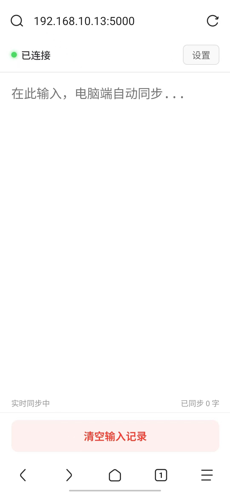

# 📱 输入同步助手 (Input Sync Helper)

> **弥补遗憾，让手机输入法成为电脑的“最强外挂”**

## 🌟 创作初衷

很多好用的输入法（如**豆包输入法**）在手机端体验极佳，却迟迟没有电脑版。为了能直接在电脑上使用手机的高质量语音识别和联想输入，我开发了这个轻量工具。它将手机化身为电脑的“无线键盘”，实现跨设备输入无缝衔接。

## 📸 界面预览

  
  

## ✨ 核心亮点

* **🎙️ 语音输入神器**：电脑打字累了？利用手机端强大的语音转文字功能（如豆包、讯飞），对着手机说话，文字即刻“飞”上电脑屏幕。
* **🔗 扫码即用**：无需数据线，无需注册账号。只要手机和电脑处于同一 Wi-Fi，扫码即连。
* **🧠 智能同步算法**：
* **双向感应**：在手机上删字，电脑同步退格；检测到电脑主动打字时，手机端自动避让，绝不打乱现有文稿。
* **极低延迟**：基于 WebSocket 协议和增量同步技术，输入体验如丝般顺滑。

* **🎨 极简设计**：轻量级后台运行，支持最小化至系统托盘，不打扰你的正常工作流。

---

## 🛠️ 技术实现

项目采用模块化架构方案：

* **后端**：基于 Python 的 `aiohttp` 异步框架，确保高并发下的输入稳定性。
* **前端**：移动端采用原生 HTML5 + WebSocket，兼容市面 99% 的手机浏览器。
* **核心逻辑**：自研增量同步算法，仅传输变动字符，极大节省流量并降低延迟。
* **跨平台**：支持 Windows 与 macOS。

---

## 🚀 快速上手

1. **下载安装**：前往 [Release 页面](https://github.com/Wuming155/InputSyncHelper/releases) 下载最新版 `InputSyncHelper_Win64_setup.exe`。
2. **启动服务**：双击运行，程序会自动生成连接二维码。
3. **扫码连接**：使用手机浏览器（推荐 Chrome/Safari）扫描二维码。
4. **开始创作**：在手机输入框内打字或使用语音，文字将实时录入电脑光标位置。

---

## 注意事项
1. 缺点就是没有那个数字证书。会被一些安全软件报毒？比如说卡巴斯基会报木马，并且把他杀掉，如果不放心的话可以把代码给AI发过去，让AI审查一下，然后自己再打包。
2. 因为本人不会写代码，包括代码、README、LICENSE等等全是让AI写的，所以会有各种各样的问题，凑合着用吧。

---
## 📝 更新日志

### v1.1.0
- **新增功能**：添加了退格次数限制自定义功能，用户可以在图形界面中输入自己想要的退格次数限制。
- **界面优化**：在主界面中添加了退格次数设置区域，包含输入框和保存按钮。
- **用户体验**：添加了输入验证和保存成功的提示信息，确保用户设置的有效性。

---
## 致谢与声明
本项目在开发过程中参考了 [CatDB](https://github.com/1900chen/CatDB) 的设计思路，感谢原作者 @1900chen 的开源贡献。